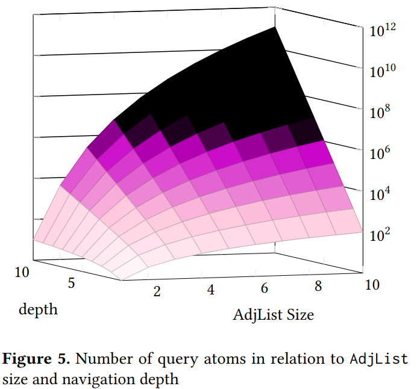

# navCSP test: Subset Sum


```
class Obj { ref : 0-* reference, attribute : int}

Context Obj inv:
  let query = self.ref.ref.....ref in
    query->sum(attribute) = Target and
    query->isUnique(attribute)
```

## Dimensions:
- n : number of pointers to model ref
- r : query depth
  - `obj.ref` -> r=0
  - `obj.ref.ref` -> r=1
- objects : number of elements in the multiset
- multi : number of different elements in the multiset
- first : first value of the multiset
- target : target sum of the problem

## Compilation & exécution
```bash
# build
./gradlew build

# run
./gradlew run
```
## the Multiset
- if `multi=4` and `first=10` the multiset will look like \{10,11,12,13,10,11,..\} repeating
- if `objects=5` and the above, the multiset will be \{10,11,12,13,10\}
- if `target=33` \{10,13\} would be a solution, if `target=0` \{\} is a solution, this multiset can't sum up to `target=1`

## the paths to SubSets
Finding a solution in our context means finding a path of n steps, from the first element, to a subset fitting the constraints.
To take a step, one leaves the current nodes and follows all the outgoing arrows.


In the image, any number of steps (>0) from 10 reaches a subset summing to 33.
From \{10\} we reach \{11,12\} in one step, from \{11,12\} we reach \{10,13\} with an additional step, and from \{10,13\} we step back to \{11,12\}.
The properties of the objects, including adjacency lists where `n=2` and `nullptr=0`:
- 1 -> ref=\{2,3\}, attrib=10
- 2 -> ref=\{1,0\}, attrib=11
- 3 -> ref=\{4,0\}, attrib=12
- 4 -> ref=\{0,0\}, attrib=13

Some example expresion evaluations:
- `obj.ref` -> \{2,3\}
- `obj.ref.attrib` -> \{11,12\}
- `obj.ref.ref` -> \{1,0,4,0\}
- `obj.ref.ref.attrib` -> \{10,0,13,0\}
- `obj.ref.ref.ref` -> \{2,3,0,0,0,0,0,0\}
- `obj.ref.ref.ref.attrib` -> \{11,12,0,0,0,0,0,0\}
- `obj.ref.ref.ref.attrib.sum()` -> 33
- `obj.ref.ref.ref.attrib.isUnique()` -> true

## size of the Paths
To model the query, we need query atoms (intermediate variables and constraints). This is hinted at in the evaluation on expressions, where the lists of pointers and attributes grow with depth.
This growth is most affected by depth, and number of pointers per reference (width).

<!--  -->


The graph in Figure 5 starts at 1 on the x,y axes or 𝑓 (1, 1),
which gives 1 on the z axis (log scale). For a single naviga-
tion from a single pointer variable (AdjList of size 1), we
have a single element constraint. For a single navigation
from an AdjList of size 10 or 𝑓 (10, 1), we have 100 element
constraints. For AdjList variables of size 1, navigating with
a query depth of 10 or 𝑓 (1, 10), results in 10 element con-
straints.
On the left background, we can see the curve resulting
from increasing AdjList size. While on the right, we can
see the the curve resulting from increasing navigation depth.
We can see from this that increasing the navigation seems
to increase the size of the problem logarithmically, while
increasing the number of pointers for a reference is expo-
nential.