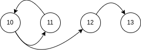

# navCSP test: Subset Sum

```
class Obj { ref : 0-* reference, attribute : int}

Context Obj inv:
  let query = self.ref.ref.....ref in
    query->sum(attribute) = Target and
    query->isUnique(attribute)
```

## Dimensions:
- n : number of pointers to model ref
- r : query depth
- objects : number of elements in the multiset
- multi : number of different elements in the multiset
- first : first value of the multiset
- target : target sum of the problem

## Compilation & exécution
```bash
# build
./gradlew build

# run
./gradlew run
```
## the Multiset
- if `multi=4` and `first=10` the multiset will look like \{10,11,12,13,10,11,..\} repeating
- if `objects=5` and the above, the multiset will be \{10,11,12,13,10\}
- if `target=33` \{10,13\} would be a solution, if `target=0` \{\} is a solution, this multiset can't sum up to `target=1`

## the paths to SubSets
Finding a solution in our context means finding a path of n steps, from the first element, to a subset fitting the constraints.
To take a step, one leaves the current nodes and follows all the outgoing arrows.



In the image, any number of steps (>0) from 10 reaches a subset summing to 33.
The adjacendy lists would be:
- 10 -> \{11,12\}
- 11 -> \{10\}
- 12 -> \{13\}
- 13 -> \{\}
From \{10\} we reach \{11,12\} in one step (`obj.ref`), from \{11,12\} we reach \{10,13\} with an additional step (`obj.ref.ref`), and from \{10,13\} we step back to \{11,12\} (`obj.ref.ref.ref`).